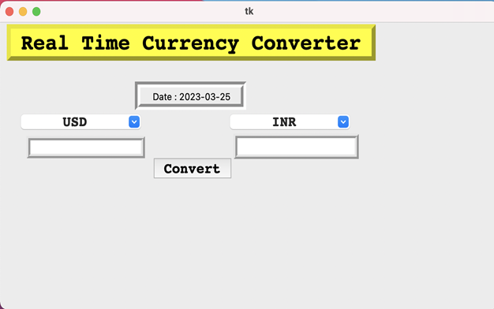
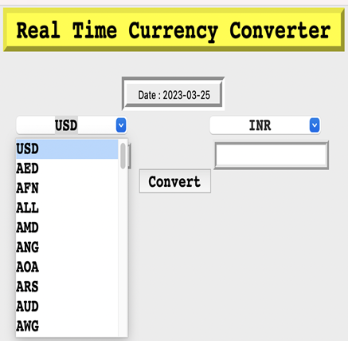
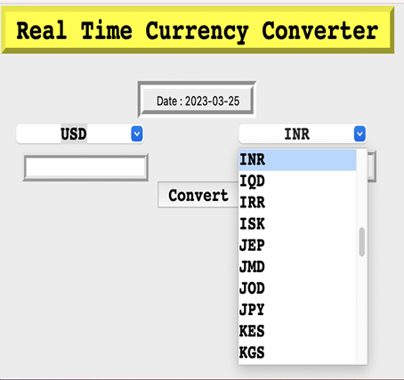
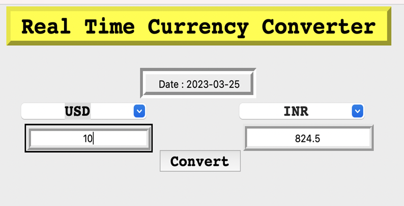

# Currency-Converter-using-python

# About Project
A real-time Python project is designed to use up-to-date exchange rates and offer quick and accurate conversions for a variety of different currencies. 
The program is built using Python and can be accessed via a user-friendly interface that allows users to easily select their desired currencies and enter the amount they wish to convert.

 # Screenshots:
  
   
   
   
   

  

 
